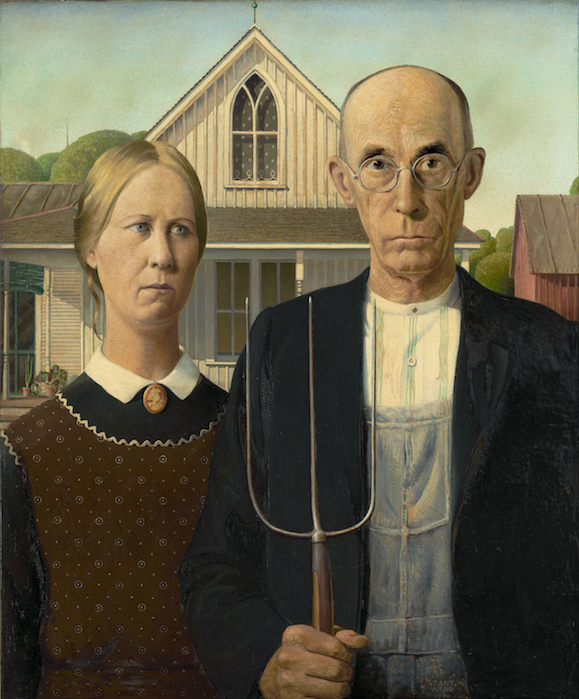

---
output:
  html_document: default
  pdf_document: default
---

#Idea farming for open science.

  

   

Science is done by people. Ideas, data, and observations inspire and motivate us. However, we can make mistakes and generate ideas that do not necessarily produce beneficial outcomes. Ideas and data can interact, and our work can certainly benefit from the bad ideas that, in the short-term, do not seem to directly benefit discovery. These relationships suggest that we should consider farming our ideas to promote open, reproducible and networked science. Farming ideas can take many forms, but the best practices should embody open science principles (such as transparency, accessibility, and reproducibility) because we benefit from the successes and failures of one another. Furthermore, we can avoid reproducing certain pitfalls whilst leveraging and mutating ideas into better ideas. 

It is a good idea to track ideas and all the processes that generate outcomes such as publications, there is inherent merit in all scientific ideas. That said, organizing and framing our ideas into the networks that we already use to examine hypotheses and questions in science is a window into our workflows including ideation, implementation, data analyses, and how we can better map ideas into open science outcomes. Formalizing and describing the linkages between ideas, data, and projects we produce as scientists will enhance and diversify the value of the work we do individually and collectively. [A recent editorial suggests that science is all about sorting the wheat from the chaff](http://www.nature.com/nature/journal/v548/n7668/full/nj7668-491a.html). In this commentary, Kirwan concluded that successful science must embrace a pluralism of ideas and that it is not a waste of time to explore ideas that do not work out. The bad-idea science paradigm proposed is a simple dichotomy defining good ideas as those that generate publications and bad as those that do not. Conceptually, ideas are thus classed as the crop species and the weeds. However, invasion biology shows that there is a lot to be learned from studying the traits of less desirable species within an ecosystem. We should individually evaluate the merit of our ideas if for no other reason then to better prepare our work for the review process of others but recognize that evolution needs mutations. That ideas are bad if they do not either directly or indirectly generate publications is perhaps too limiting. New ideas are novel, and new and useful ideas are creative. The former can become the subtrate for the latter. Useless today can become indispensible tomorrow. Sorting the wheat from the chaff is an exercise in predicting an unknown landscape of discovery. Introspection of our workflows and the relationship between ideation and implementation will nonetheless streamline the mapping of ideas and hypotheses to effective testing through evidence. However, we also need to ensure that ideas do not get lost through self-criticism, lack of data, availability of a mechanism to test today, or through entanglement in the quagmire of extensive information we process as scientists. In a PeerJ pre-print, I examined my [relative idea management and outcomes to explore whether this more generous interpretation of merit and my workflow kept some of the wheat and most of the chaff](https://peerj.com/manuscripts/20783/). A more inclusive count of open science outcomes in addition to traditional peer-reviewed publications showed that papers ranked second after the open science products category. This suggests that open science products such as datsets, slidedecks, figures, and code can be a productive mechnanism to share ideas. It also suggests that we need repositories not just for these outcomes such as data but for the ideas.
 
We live in a data deluge wherein we are uninundated with and perhaps as scientists routinely compelled to collect data. More intriguingly, it is worthwhile to not only ask can I collect useful data as a scientist, but to revisit the wheat-chaff metaphor, am I a good (i.e. reasonable) idea farmer? Does my process embrace and retain ideas that can support a meaningful, and at times, evidence-based decision process in mobilizing and disseminating research from the insights that I possess as an expert? Data can embody ideas - bad and good ones! We must openly publish more of our data to stimulate these discoveries for others. Recognized open science products (with a DOI) such as published datasets, data publications, figures, and code repositories are thus likely both a critical catalyst for new ideas for similar cognitively-minded scientists and an invaluable outcome in addition to traditional papers. An alternative perspective is that one can work backwards from an idea not forward. The idea is the vision and the principal object, and the data and the experiments are iterations to explore its merit. Scientific synthesis is clearly not just a formal method we can use to describe the work of others but a critical tool we need to practice individually. Hence, workflows that stimulate and faciliate connecting ideas and data into networks will promote more creative and more integrated science. A diverse crop of ideas and outcomes is better than just wheat.

